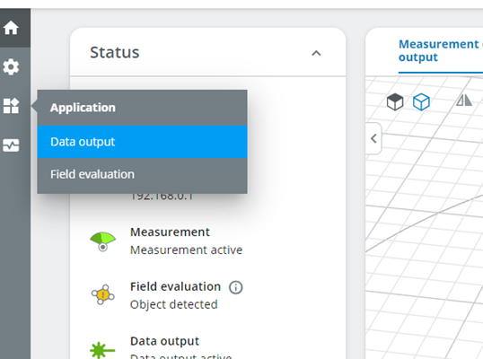
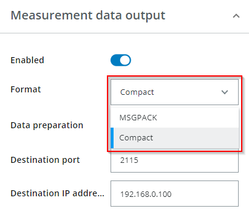
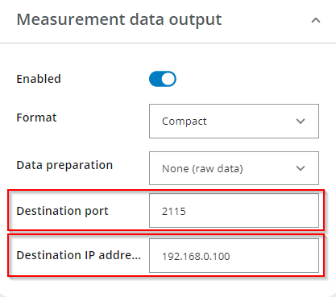
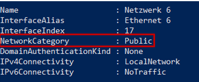

# ScanSegmentAPICSharp

This project contains a C# deserializer for the SICK Compact format and a example how to use the deserializer.

The following product families are currently supported:

- multiScan100 (e.g. 1131164)
- picoScan100 (e.g. 1134610)

## Project setup

### Configure the data output of the sensor

Follow these steps to configure the device to receive data:

- Open a browser and open the web interface of the device (http://192.168.0.1/ in case the device has the default ip address)
- Select “Application/Data output” in the main menu.

  
- Set format to Compact.

  
- Set the port to 2115 and the IP address to the address of your network interface for the connection to the sensor. Enable the data output.

  

### Adapt network rules to receive UDP packages

Since the UDP stream is sent from the device to the computer it is necessary to allow inbound UDP traffic on the configured UDP port. The computer's firewall must be configured accordingly.

On Windows, it is also important to set the Network Category to private. To do this,

- Start a PowerShell window with administrator rights.
- Then execute following command:
  ```ps
  $ Get-NetConnectionProfile
  ```
- Identify the network adapter to which the device is connected.


  
- If the network category is `Public` run following command to change it to `Private`

```ps
$ Set-NetConnectionProfile -InterfaceIndex (your InterfaceIndex(line3)) -NetworkCategory Private
$ Set-NetConnectionProfile -InterfaceIndex 17 -NetworkCategory Private
```

### Run the example code to receive data

Prerequisite: The dotnet framework must be installed. Please see the field `TargetFramework` in  Example.csproj for the minimum required version.

- Change to `src/Example`
- Execute the command (from a shell): `dotnet run`

## General structure of the Compact format

A detailed description of the Compact format can be found in this documentation:
https://cdn.sick.com/media/docs/2/22/622/technical_information_data_format_description_de_im0104622.pdf

## Accessing data

The following table shows how to access the data contained in a Compact UDP telegram from a C# `CompactSegment` object.

**Legend:**

- _E_ stands for a specific echo number
- _M_ stands for a specific module number
- _SC_ stands for a specific scan number within a module, which is used in the Compact format
- _B_ stands for a specific beam

| Compact                                                | Data access to Compact packages using the ScanSegmentAPI  |
| :----------------------------------------------------- | :-------------------------------------------------------- |
| Header: StartOfFrame                                   | segment.Header.StartOfFrame                               |
| Header: CommandId                                      | segment.Header.CommendId                                  |
| Header: TelegramCounter                                | segment.Header.TelegramCounter                            |
| Header: TimeStampTransmit                              | segment.Header.TimestampTransmit                          |
| Header: TelegramVersion                                | segment.Header.Version                                    |
| Header: SizeModule0                                    | segment.Header.SizeOfFirstModule                          |
| MetaData Module _M_: SegmentCounter                    | segment.Modules[*M*].MetaData.SegmentCounter              |
| MetaData Module _M_: FrameNumber                       | segment.Modules[*M*].MetaData.FrameNumber                 |
| MetaData Module _M_: SenderId                          | segment.Modules[*M*].MetaData.SenderId                    |
| MetaData Module _M_: NumberOfLinesInModule             | segment.Modules[*M*].MetaData.NumberOfLinesInModule       |
| MetaData Module _M_: NumberOfBeamsPerScan              | segment.Modules[*M*].MetaData.NumberOfBeamsPerScan        |
| MetaData Module _M_: NumberOfEchosPerBeam              | segment.Modules[*M*].MetaData.NumberOfEchosPerBeam        |
| MetaData Module _M_: TimeStampStart                    | segment.Modules[*M*].MetaData.TimestampStart[*SC*]        |
| MetaData Module _M_: TimeStampStop                     | segment.Modules[*M*].MetaData.TimestampStop[*SC*]         |
| MetaData Module _M_: Phi                               | segment.Modules[*M*].MetaData.Phi[*SC*]                   |
| MetaData Module _M_: ThetaStart                        | segment.Modules[*M*].MetaData.ThetaStart[*SC*]            |
| MetaData Module _M_: ThetaStop                         | segment.Modules[*M*].MetaData.ThetaStop[*SC*]             |
| MetaData Module _M_: DistanceScalingFactor             | segment.Modules[*M*].MetaData.DistanceScalingFactor       |
| MetaData Module _M_: NextModuleSize                    | segment.Modules[*M*].MetaData.NextModuleSize              |
| MetaData Module _M_: Reserved 1                        | -                                                         |
| MetaData Module _M_: DataContentEchos                  | -                                                         |
| MetaData Module _M_: DataContentBeams                  | -                                                         |
| MetaData Module _M_: Reserved2                         | -                                                         |
| MeasurementData Module _M_ Beam _B_ Echo _E_: Distance | segment.Modules[*M*].Beams[_B_][*SC*].Echos[*E*].Distance |
| MeasurementData Module _M_ Beam _B_ Echo _E_: RSSI     | Modules[*M*].Beams[_B_][*SC*].Echos[*E*].RISSI            |
| MeasurementData Module _M_ Beam _B_: Properties        | segment.Modules[*M*].Beams[_B_][*SC*].Property            |
| MeasurementData Module _M_ Beam _B_: Theta             | segment.Modules[*M*].Beams[_B_][*SC*].Theta               |
| Framing: CRC                                           |                                                           |
